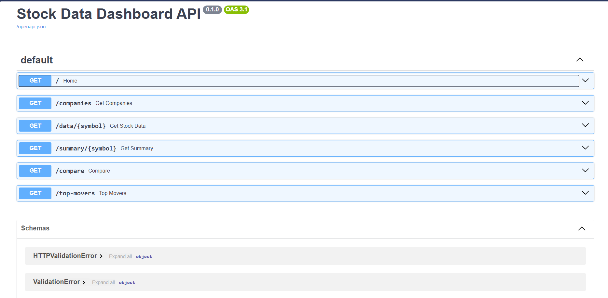
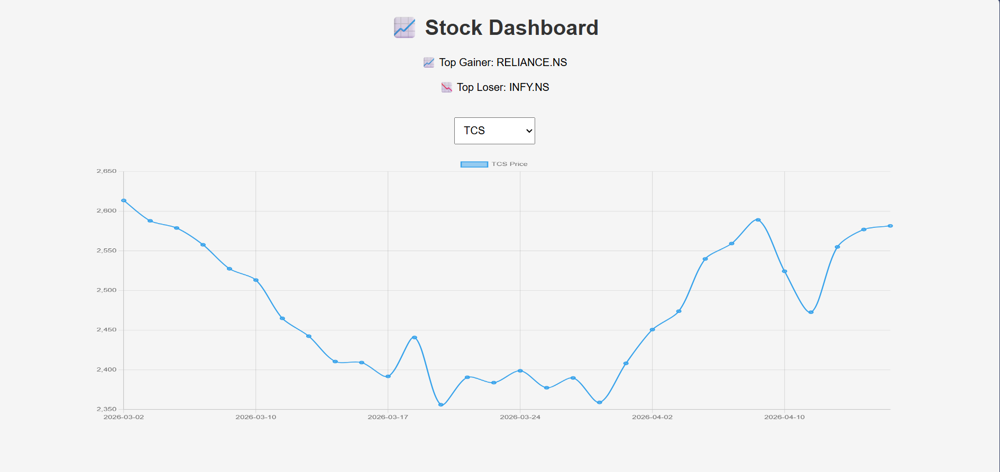
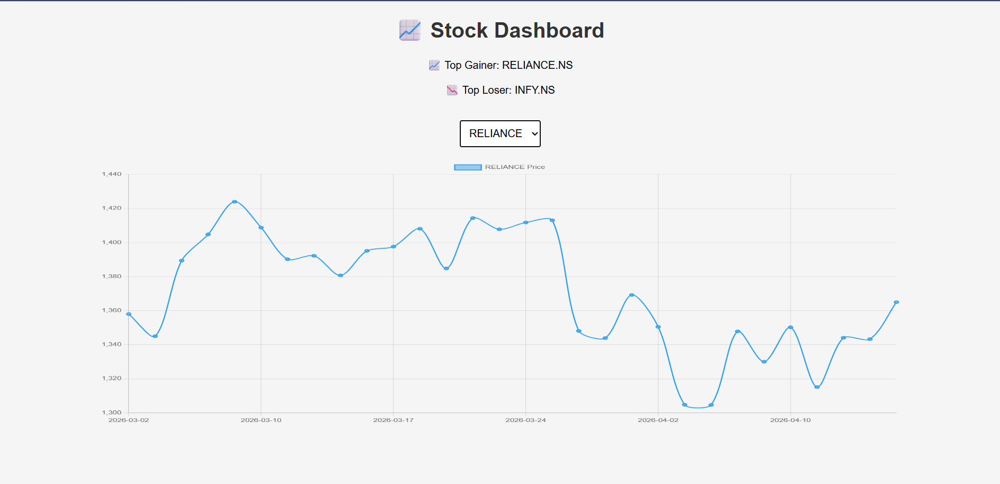

# 📈 Stock Data Intelligence Dashboard

## 🚀 Overview

This project is a financial data dashboard that collects, processes, and visualizes stock market data using real-time APIs.

---

## ⚙️ Tech Stack

* Python (FastAPI)
* Pandas, NumPy
* yfinance
* Chart.js
* HTML, CSS, JavaScript

---

## 📊 Features

### 🔹 Data Processing

* Daily Return
* 7-day Moving Average
* 52-week High/Low
* Volatility (custom metric)

### 🔹 APIs

* `/companies`
* `/data/{symbol}`
* `/summary/{symbol}`
* `/compare`
* `/top-movers` (extra feature)

### 🔹 Dashboard

* Interactive chart
* Compare two stocks
* Summary insights
* Top gainer/loser

---

## ▶️ Run Locally

### Backend

cd backend
pip install -r requirements.txt
uvicorn main:app --reload

### Frontend

Open frontend/index.html using Live Server

---

## 📸 Screenshots

---

## 💡 Extra Features

* Volatility metric
* Compare stocks
* Top movers analysis

---

## 🎯 Conclusion

This project demonstrates backend API development, real-time data processing, and interactive visualization.
